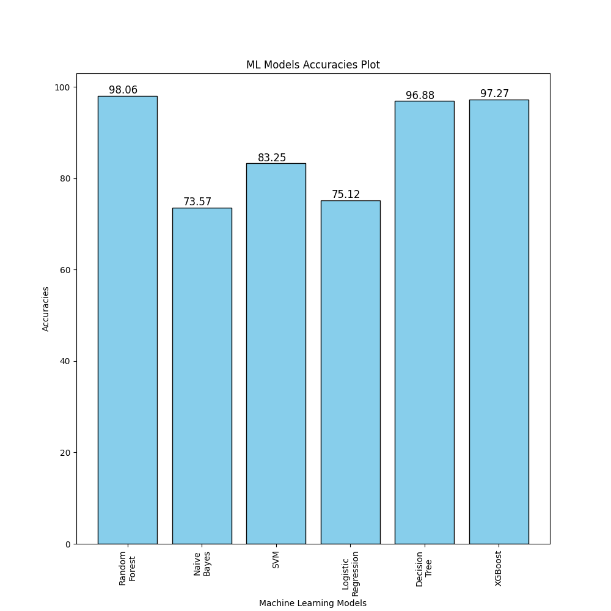
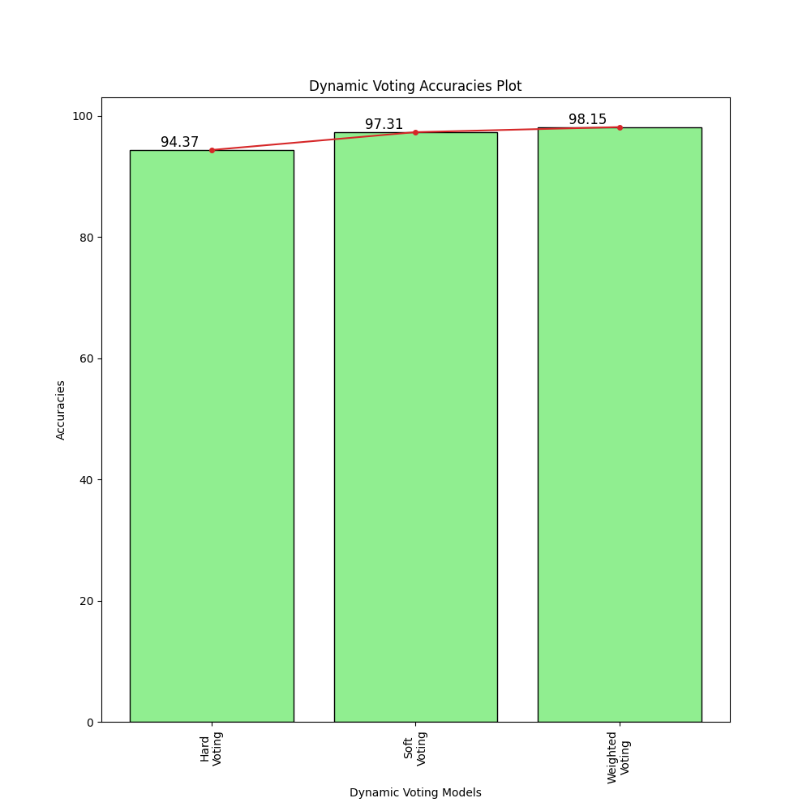
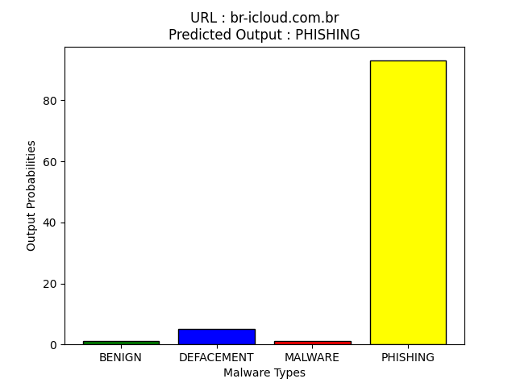
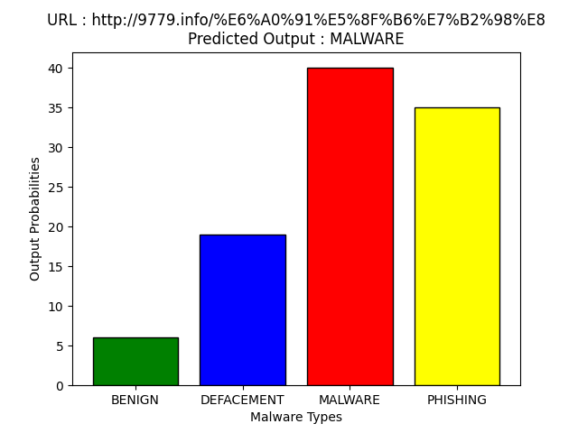

# Malware-Detection-Base-Learners-Dynamic-Voting

The objective of this project is to create an advanced system for precisely classifying URLs linked to websites and APIs, labeling them as phishing, benign, defacement, or malware. The project emphasizes the use of various machine learning models like Random Forest, Decision Tree, Logistic Regression, SVM, and Naive Bayes. It also delves into inventive ensemble approaches such as Majority Voting with Soft Voting and Weighted Voting. The primary aim is to boost detection accuracy and dependability by extensively comparing individual models and ensemble methods. This contribution to cybersecurity aims to establish a strong defense against evolving digital risks
## Getting Started


### Clone the Repository

```bash
git clone https://github.com/Hirkani2003/Malware-Detection-Base-Learners-Dynamic-Voting

cd your-repo
```
### Create and Activate a Virtual Environment
On Windows:
```bash
python -m venv venv
venv\Scripts\activate
```
On macOS and Linux:
```bash
python3 -m venv venv
source venv/bin/activate
```
## Install Requirements
Use the package manager [pip](https://pip.pypa.io/en/stable/installation/) to install.
```bash
pip install -r requirements.txt
```

## Usage
### URL Prediction
```
python main.py predict -i url/link/
```

## Model Results
### Machine Learning Models

### Dynamic Voting Models



## Prediction Results
### Benign

### Phishing

### Defacement

### Malware

